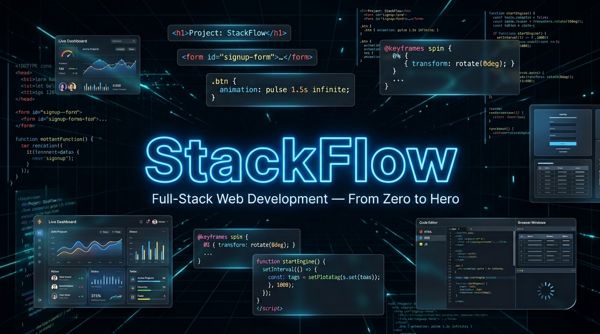

<div align="center">



<h1>⚡ StackFlow — Full-Stack Web Development Learning Journey</h1>

<p>A structured, hands-on full-stack web development learning repository covering HTML, CSS, JavaScript, PHP, and React — built through real lab programs, practical experiments, and progressive challenges.</p>

<p align="center">
  
  
  
  
  
  
  
</p>

</div>

---

## 📁 Project Structure

```
StackFlow/
├── 📄 README.md                    # Project documentation
├── 📄 LICENSE                      # MIT License
├── 📄 .gitignore                   # Git ignore patterns
│
├── 📂 assets/
│   └── 🖼️  StackFlow.png           # Project banner image
│
├── 📂 HTML/                        # Core HTML learning pages
│   ├── 📄 index.html               # HTML document structure, headings, anchor tag, span
│   ├── 📄 heading.html             # H1–H6 hierarchy, <pre>, <hr>, <br>
│   ├── 📄 formating.html           # Text formatting: <b>, <strong>, <em>, <sub>, <sup>
│   ├── 📄 colors.html              # Colors, inline styles, <abbr>, <bdo>, <blockquote>, <cite>
│   ├── 📄 linktags.html            # Anchor tags, mailto, internal anchor scroll
│   └── 📄 style.css                # Global stylesheet (background color, font color)
│
├── 📂 CSS/                         # Core CSS learning files (coming soon)
│   └── 📄 .gitkeep
│
├── 📂 JS/                          # Core JavaScript learning scripts
│   ├── 📄 variable.js              # var, let, const — scope, reassignment, console.table
│   ├── 📄 datatypes.js             # JS data types — number, string, boolean, null, undefined, symbol
│   ├── 📄 ConversionOperation.js   # Type conversion — Number(), typeof operator
│   └── 📄 test.js                  # Scratch/test file
│
├── 📂 PHP/                         # PHP learning files (coming soon)
│   └── 📄 .gitkeep
│
├── 📂 REACT/                       # React learning files (coming soon)
│   └── 📄 .gitkeep
│
└── 📂 PCS-693/                     # FSWD Lab Programs — 29 Practicals
    │
    ├── 📂 HTML/                    # 9 HTML Practicals
    │   ├── 📄 P1.html              # Text formatting tags — <strong>, <em>, <mark>, <code>, <kbd>, <abbr>, <pre>
    │   ├── 📄 P2.html              # Star figure using <pre> tag
    │   ├── 📄 P3.html              # Complex table — rowspan & colspan (Course-wise subjects)
    │   ├── 📄 P4.html              # Image table — Mobile network logos with colspan
    │   ├── 📄 P5.html              # Image map — Clickable regions using <map> and <area>
    │   ├── 📄 P6.html              # HTML Form — fieldset, radio, checkbox, color picker
    │   ├── 📄 P7.html              # Hotel Customer Profile Form — text, number, radio, select, submit
    │   ├── 📄 P8.html              # HTML5 tags — <video>, <audio>, <article>, <datalist>, <bdi>, <embed>, <output>
    │   └── 📄 P9.html              # Nested lists — ordered & unordered (Programming Languages & Web Dev)
    │
    ├── 📂 CSS/                     # 9 CSS Practicals
    │   ├── 📄 P1.html              # Link pseudo-classes — :link, :visited, :active
    │   ├── 📄 P2.html              # box-shadow and text-shadow
    │   ├── 📄 P3.html              # border-radius — Rounded corners
    │   ├── 📄 P4.html              # Multi-column newspaper layout — column-count, column-gap, column-rule
    │   ├── 📄 P5.html              # CSS transitions — background-color change + rotate(360deg) on hover
    │   ├── 📄 P6.html              # Fixed background — background-attachment: fixed
    │   ├── 📄 P7.html              # Background positioning — background-position, repeat-x, background-size
    │   ├── 📄 P8.html              # CSS positioning — static, relative, absolute, fixed, sticky
    │   └── 📄 P9.html              # Full styled webpage — header, nav, sections, footer, pseudo-elements
    │
    ├── 📂 JS/                      # 11 JavaScript Practicals
    │   ├── 📄 P1.html              # Credit card validator — regex for Visa, MasterCard, Amex
    │   ├── 📄 P2.html              # Form validation — name, email, password with regex
    │   ├── 📄 P3.html              # Country-Capital matcher — dropdown + JS object lookup
    │   ├── 📄 P4.html              # Simple calculator — +, -, *, / with input validation
    │   ├── 📄 P5.html              # Self-modifying page — random bg color + time update via setInterval
    │   ├── 📄 P6.html              # Running digital clock — live HH:MM:SS via setInterval
    │   ├── 📄 P7.html              # Birthday day finder — day of week using Date object
    │   ├── 📄 P8.html              # Telephone number parser — split area code & number using string methods
    │   ├── 📄 P9.html              # JS functions — leftmost vowel finder + number reverser
    │   ├── 📄 P10.html             # Case converter — toggles uppercase ↔ lowercase char by char
    │   └── 📄 P11.html             # Car survey — dynamic results table tracking city × model votes
    │
    └── 📄 FSWDLabManual.pdf        # Official lab manual
```

---

## 🎯 HTML/ — Core Pages

| 📄 File | 🎯 What It Covers |
|---------|-------------------|
| [index.html](HTML/index.html) | HTML document structure, headings, anchor tag, span |
| [heading.html](HTML/heading.html) | H1–H6 hierarchy, `<pre>`, `<hr>`, `<br>` |
| [formating.html](HTML/formating.html) | `<b>`, `<strong>`, `<em>`, `<sub>`, `<sup>`, lists |
| [colors.html](HTML/colors.html) | Inline styles, RGB/hex colors, `<abbr>`, `<bdo>`, `<blockquote>`, `<cite>` |
| [linktags.html](HTML/linktags.html) | `<a>` tags, `mailto:`, `target="_blank"`, internal anchor scroll |
| [style.css](HTML/style.css) | Global CSS — background color, font color |

---

## ⚙️ JS/ — Core JavaScript Scripts

| 📄 File | 🎯 What It Covers |
|---------|-------------------|
| [variable.js](JS/variable.js) | `var`, `let`, `const` — scope, reassignment, `console.table` |
| [datatypes.js](JS/datatypes.js) | JS primitives — `number`, `string`, `boolean`, `null`, `undefined`, `symbol`, `typeof` |
| [ConversionOperation.js](JS/ConversionOperation.js) | Type conversion — `Number()`, `typeof` operator |
| [test.js](JS/test.js) | Scratch/test file |

---

## 🔜 Coming Soon

| 📂 Folder | 🚀 What's Planned |
|-----------|-------------------|
| `CSS/` | Core CSS — selectors, box model, flexbox, grid, animations |
| `PHP/` | PHP fundamentals — syntax, forms, functions, MySQL integration |
| `REACT/` | React — components, props, state, hooks, routing |

---

## 💻 PCS-693 — FSWD Lab Programs

### 🧩 HTML Practicals

| # | 📄 File | 📚 Concept |
|---|---------|------------|
| 1 | [P1.html](PCS-693/HTML/P1.html) | `<strong>`, `<em>`, `<u>`, `<mark>`, `<code>`, `<kbd>`, `<samp>`, `<abbr>`, `<blockquote>`, `<pre>`, `<small>` |
| 2 | [P2.html](PCS-693/HTML/P2.html) | Star figure pattern drawn using `<pre>` tag |
| 3 | [P3.html](PCS-693/HTML/P3.html) | Complex table — `rowspan` & `colspan` (MBA & MCM course subjects with marks) |
| 4 | [P4.html](PCS-693/HTML/P4.html) | Image table — Mobile network logos with `colspan` |
| 5 | [P5.html](PCS-693/HTML/P5.html) | Image map — Clickable hotspot regions using `<map>` and `<area shape="rect">` |
| 6 | [P6.html](PCS-693/HTML/P6.html) | HTML Form — `<fieldset>`, `<legend>`, text, radio, checkbox, color picker, submit/reset |
| 7 | [P7.html](PCS-693/HTML/P7.html) | Hotel Customer Profile Form — name, address, age, gender, room type, payment type |
| 8 | [P8.html](PCS-693/HTML/P8.html) | HTML5 semantic & media tags — `<video>`, `<audio>`, `<article>`, `<datalist>`, `<bdi>`, `<embed>`, `<output>` |
| 9 | [P9.html](PCS-693/HTML/P9.html) | Nested lists — Programming Languages (Python, Java) & Web Dev (Frontend, Backend) |

### 🎨 CSS Practicals

| # | 📄 File | 📚 Concept |
|---|---------|------------|
| 1 | [P1.html](PCS-693/CSS/P1.html) | Link pseudo-classes — `:link` (pink), `:active` (blue), `:visited` (green) |
| 2 | [P2.html](PCS-693/CSS/P2.html) | `box-shadow: 10px 10px 8px gray` and `text-shadow: 3px 3px 5px gray` |
| 3 | [P3.html](PCS-693/CSS/P3.html) | `border-radius: 20px` — Rounded corners on a box |
| 4 | [P4.html](PCS-693/CSS/P4.html) | Multi-column newspaper layout — `column-count: 3`, `column-gap`, `column-rule` |
| 5 | [P5.html](PCS-693/CSS/P5.html) | CSS transitions — `background-color 2s` + `transform: rotate(360deg)` on hover |
| 6 | [P6.html](PCS-693/CSS/P6.html) | Fixed background — `background-attachment: fixed` with scrollable content |
| 7 | [P7.html](PCS-693/CSS/P7.html) | Background positioning — `background-position: top right`, `repeat-x`, `background-size: 200px` |
| 8 | [P8.html](PCS-693/CSS/P8.html) | CSS positioning — `static`, `relative`, `absolute`, `fixed`, `sticky` all in one demo |
| 9 | [P9.html](PCS-693/CSS/P9.html) | Full styled webpage — header, nav, sections, footer, `::after` pseudo-element overlay, all link states |

### ⚙️ JavaScript Practicals

| # | 📄 File | 📚 Concept |
|---|---------|------------|
| 1 | [P1.html](PCS-693/JS/P1.html) | Credit card validator — regex for Visa (`^4`), MasterCard (`^5[1-5]`), Amex (`^3[47]`) |
| 2 | [P2.html](PCS-693/JS/P2.html) | Form validation — name (letters only), email (regex), password (8+ chars, number + special char) |
| 3 | [P3.html](PCS-693/JS/P3.html) | Country-Capital matcher — dropdown selection + JS object lookup to verify correct pairs |
| 4 | [P4.html](PCS-693/JS/P4.html) | Simple calculator — `+`, `-`, `*`, `/` with divide-by-zero and NaN validation |
| 5 | [P5.html](PCS-693/JS/P5.html) | Self-modifying page — random background color + current time update every 60s via `setInterval` |
| 6 | [P6.html](PCS-693/JS/P6.html) | Running digital clock — live `HH:MM:SS` with leading zeros, updates every second via `setInterval` |
| 7 | [P7.html](PCS-693/JS/P7.html) | Birthday day finder — `<input type="date">` + `Date.getDay()` to find day of week |
| 8 | [P8.html](PCS-693/JS/P8.html) | Telephone number parser — splits `(555)555-555` into area code and number using `split()` |
| 9 | [P9.html](PCS-693/JS/P9.html) | JS functions — leftmost vowel position finder + number reverser using `split().reverse().join()` |
| 10 | [P10.html](PCS-693/JS/P10.html) | Case converter — toggles each character between uppercase ↔ lowercase using `toUpperCase()`/`toLowerCase()` |
| 11 | [P11.html](PCS-693/JS/P11.html) | Car survey — dynamic results table tracking votes per city × car model using JS object indexing |

---

## 🚀 Getting Started

```bash
# Clone the repo
git clone https://github.com/AbhishekGiri04/StackFlow.git

cd StackFlow

# Open in browser
open HTML/index.html

# Or spin up a local dev server
python -m http.server 8000
# → Visit http://localhost:8000
```

> No build tools, no dependencies — just open any `.html` file in your browser and go.

---

## 🎓 Learning Outcomes

After exploring this project, you will understand:

✅ **HTML Structure** — Semantic markup, tables, forms, image maps, HTML5 media tags  
✅ **CSS Styling** — Box model, shadows, backgrounds, transitions, positioning, pseudo-elements  
✅ **JavaScript DOM** — Selection, manipulation, and dynamic rendering  
✅ **JS Fundamentals** — Variables, data types, type conversion, scope (`var`/`let`/`const`)  
✅ **Form Validation** — Regex-based input validation for name, email, password, credit cards  
✅ **CSS Animations** — Transitions, transforms, pseudo-classes  
✅ **Date API** — Working with `Date` object and `getDay()` for time-based logic  
✅ **Live Updates** — `setInterval` for real-time clocks and self-modifying pages  
✅ **String Methods** — `split()`, `reverse()`, `join()`, `toUpperCase()`, `toLowerCase()`  
✅ **Multi-column Layouts** — `column-count`, `column-gap`, `column-rule`  
✅ **CSS Positioning** — `static`, `relative`, `absolute`, `fixed`, `sticky`

---

## 🛠️ Tech Stack

| 🖥️ Technology | ⚙️ Purpose | 📊 Status |
|---------------|------------|-----------|
|  | Structure & Markup | ✅ Active |
|  | Styling & Layout | ✅ Active |
|  | Interactivity & Logic | ✅ Active |
|  | Server-side Scripting | 🔜 Coming Soon |
|  | Frontend Framework | 🔜 Coming Soon |

---

## 🌟 Key Features

- **📄 29 Lab Programs** — 9 HTML + 9 CSS + 11 JavaScript practicals
- **📚 Educational** — Clear, well-structured code with progressive difficulty
- **🚀 Practical** — Real-world HTML, CSS, and JavaScript use cases
- **🔧 Modular** — Separate folders for HTML, CSS, JS, PHP, REACT, and PCS-693 labs
- **⚙️ Zero Setup** — No build tools or dependencies, just open in a browser
- **💡 Learning-Focused** — Step-by-step progression from basics to advanced frameworks

---

<div align="center">

## 📞 Contact & Support

**👤 Abhishek Giri** — Creator & Maintainer

<a href="https://linkedin.com/in/abhishekgiri04">
  
</a>
<a href="https://github.com/abhishekgiri04">
  
</a>
<a href="mailto:abhishekgiri.dev@gmail.com">
  
</a>

---

## 📄 License

This project is open source and available under the **MIT License** — see the [LICENSE](LICENSE) file for details.

---

**⚡ Built with ❤️ for Learning Web Development**

*Mastering HTML, CSS, JavaScript, PHP & React from the ground up*


**© 2026 Abhishek Giri | StackFlow**

</div>
